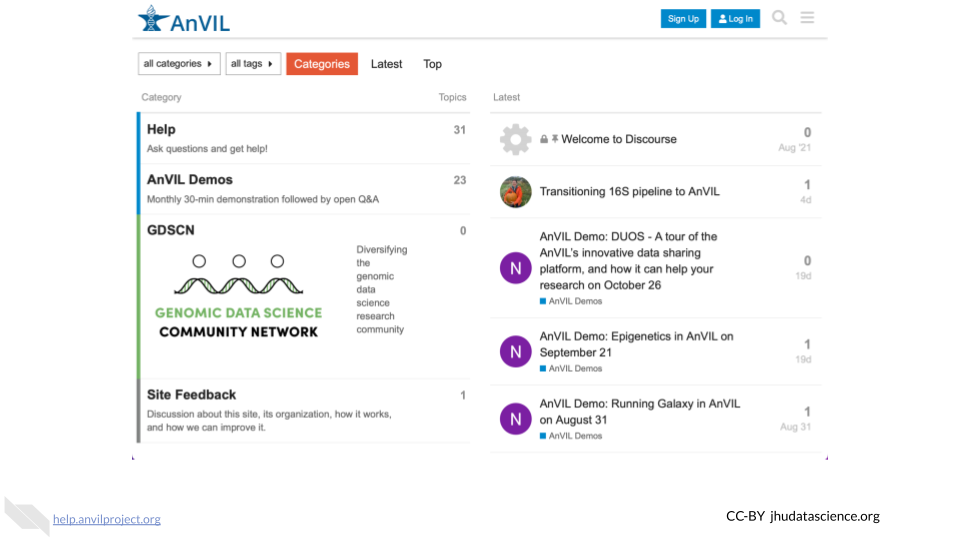

```r
knitr::opts_chunk$set(out.width = "100%")
```

# Join Discourse

Congratulations!  You've practiced running WDL Workflows on AnVIL-powered-by-Terra, importing and configuring publicly available WDL workflows, writing an introductory WDL using the web-based editor at Broad Methods Repository, calculating idxstats across multiple genomic data files, and customizing your own Docker image.

Please take 5 minutes to let us know how we could improve this course at http://broad.io/wdlBookSurvey.

And please join the the conversation in the AnVIL Support Forums at https://help.anvilproject.org where you can ask any and all questions and we'll do our best to help!


